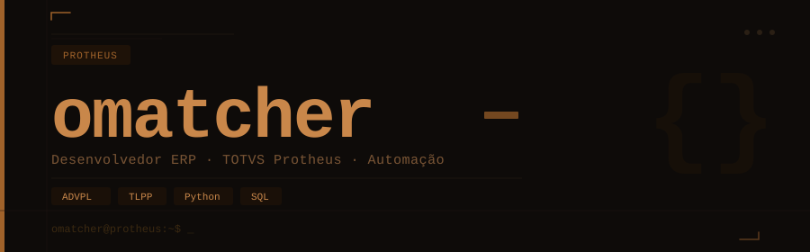
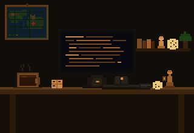

---

<div align="center">

</div>

```bash
omatcher@protheus:~$ whoami
Desenvolvedor ERP apaixonado por automação

omatcher@protheus:~$ cat sobre.txt
> 10 anos sobrevivendo ao ecossistema TOTVS
> ADVPL e TLPP fluente — inclusive as partes que ninguém documenta
> Python e SQL pra tudo que o Protheus não resolve 
> Em off: xadrez, board games, música e tech

omatcher@protheus:~$ █
```

<br clear="right"/>

---

<div align="center">

### 🛠️ Stack


</div>

---

<div align="center">

### 📊 Atividade

[](https://github.com/omatcher)

[](https://github.com/omatcher)

</div>

---

<div align="center">

[](https://www.linkedin.com/in/matheushtsilva/)

</div>
